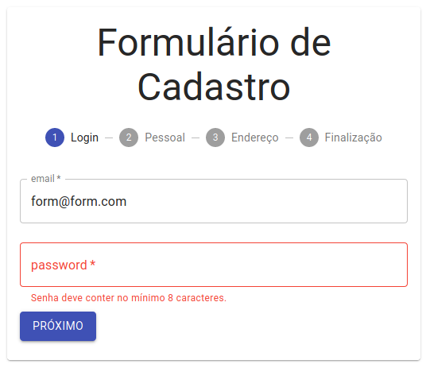
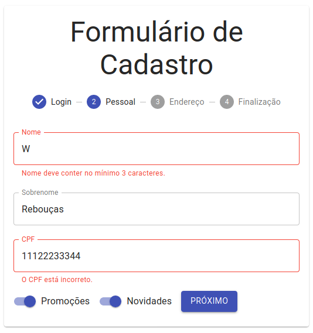
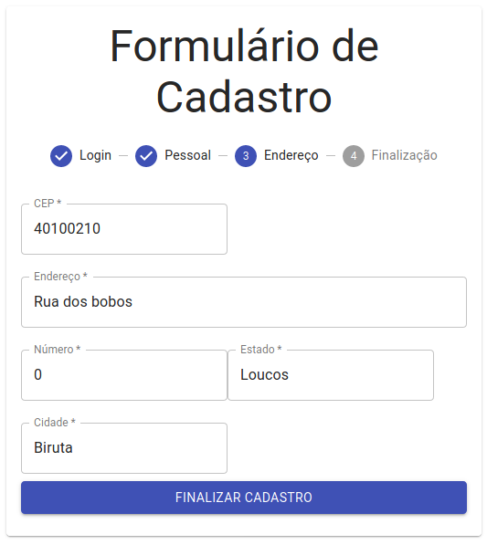
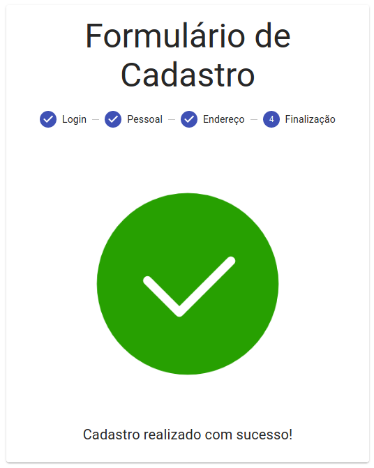

<h1 align="center"> Registration Form </h1>

	
	

  <a href="#projeto">Projeto</a>&nbsp;&nbsp;&nbsp;|&nbsp;&nbsp;&nbsp;
  <a href="#layout">Layout</a>&nbsp;&nbsp;&nbsp;|&nbsp;&nbsp;&nbsp;
  <a href="#tecnologias">Tecnologias</a>&nbsp;&nbsp;&nbsp;|&nbsp;&nbsp;&nbsp;
  <a href="#bookmark_tabs-certificados">Certificados</a>&nbsp;&nbsp;&nbsp;|&nbsp;&nbsp;&nbsp;
  <a href="#page_with_curl-licencia">Licencia</a>

## Projeto

O Registration Form é um projeto idealizado pela 
<a href="https://alura.com.br/"> **Alura** </a> 
com a intensão de criar um formulário com suas devidas validações.

Assuntos abordados:

    Material UI
    Function Components
    Formulários controlados e não controlados

    Hooks
    Lógica de maquina de estados
    Context API 
    Melhores práticas ao trabalhar com propriedades
    Técnicas de validação de dados em formulários

## Layout

		

		

		

		

## Tecnologias

- [Javascript](https://www.javascript.com/)
- [React](https://reactjs.org)

## :bookmark_tabs: Certificados 

## :page_with_curl: Licencia 

Esse projeto está sob a licença MIT. 

---

Feito com ♥ by Wesley Rebouças

